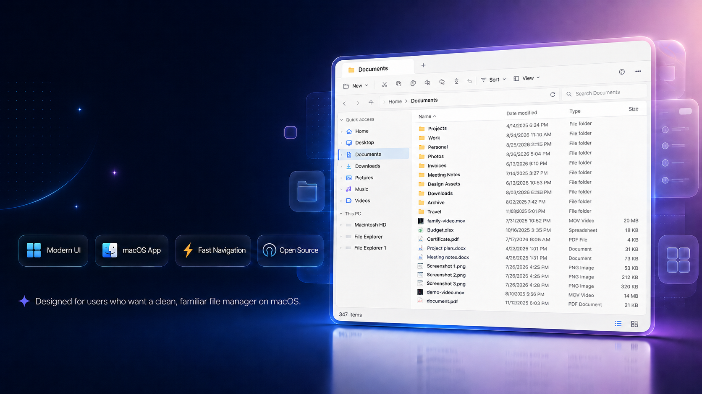
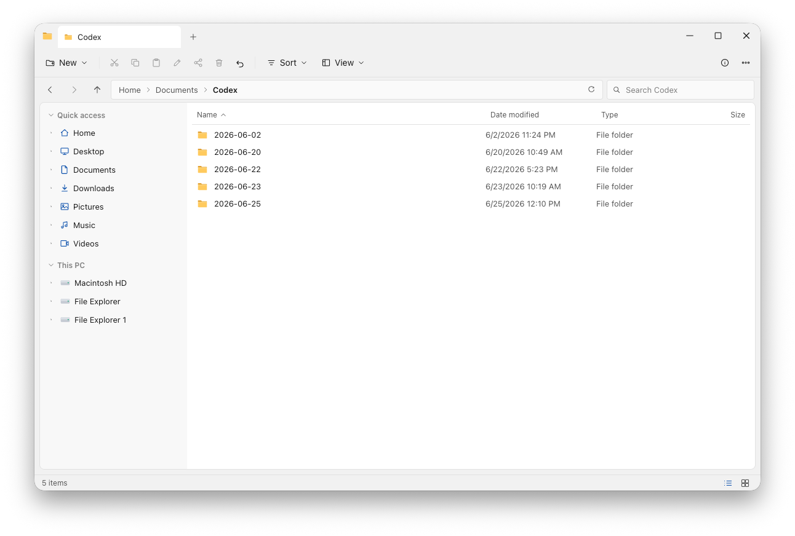
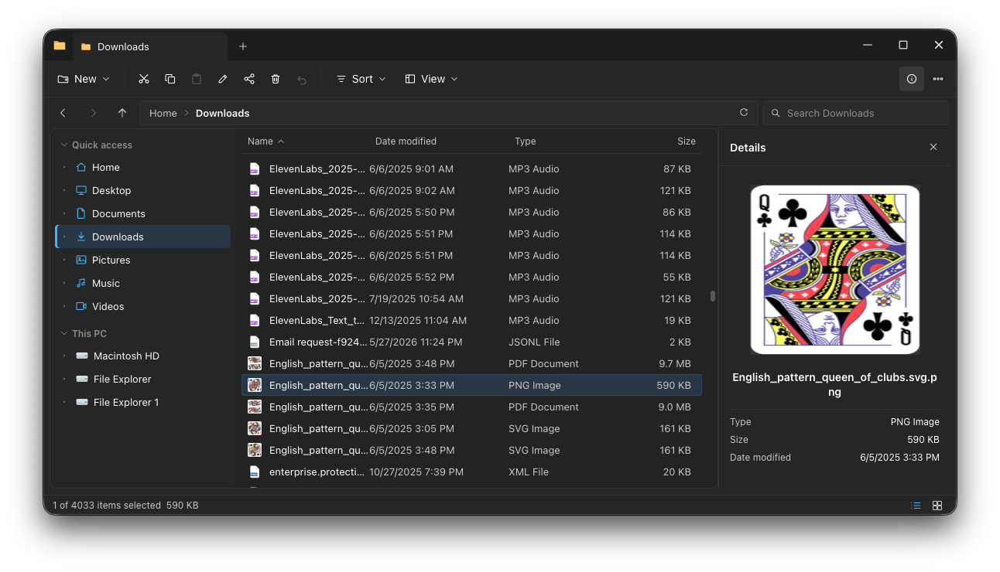
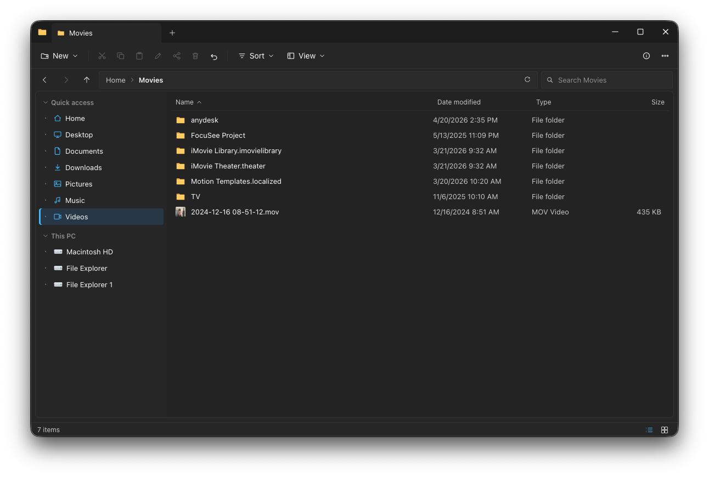

<div align="center">

# 🗂 File Explorer for Mac

### A fast, modern, tabbed file manager for macOS.

Browse, preview, and organize your files with a native, dark-mode-ready interface —
built for both Apple Silicon and Intel.

[](https://github.com/file-explorer-mac/file-explorer-mac/releases/latest)
[](LICENSE)
[-black?style=for-the-badge&logo=apple)](#download)



</div>

---

## 💡 Why I built this

I switched from Windows to macOS two years ago and got used to just about
everything — except the stupid Finder, which misses so many features I'd come to
rely on. So I built File Explorer: a file manager that simply works. And I
open-sourced it.

## ✨ Features

- **🗂 Tabbed browsing** — keep multiple folders open in a single window.
- **🧭 Sidebar + breadcrumb navigation** — jump anywhere fast, with a clickable path bar.
- **👁 Live preview pane** — peek at files without opening them, with rich thumbnails.
- **📋 Smart file operations** — copy, move, and delete with conflict resolution and
  progress overlays for long-running jobs.
- **🖱 Right-click everything** — full context menus for files and folders.
- **↕ Drag-and-drop** — move and organize files the way you expect.
- **ℹ︎ Properties at a glance** — size, dates, and details in a clean dialog.
- **🌓 Native dark mode** — follows your macOS appearance automatically.
- **🍎 Universal & notarized** — runs natively on Apple Silicon and Intel; signed and
  notarized by Apple, so it opens without Gatekeeper warnings.

## 📥 Download

Grab the latest `.dmg` from the [**Releases page**](https://github.com/file-explorer-mac/file-explorer-mac/releases/latest),
open it, and drag **File Explorer** into your Applications folder.

Because the app is signed with a Developer ID and notarized by Apple, it launches
on first run with no "unidentified developer" prompts.

> Requires macOS. Universal binary — no separate Intel/Apple Silicon downloads.

**Automatic updates.** Once installed, File Explorer checks GitHub Releases for a
newer version on launch and downloads it in the background. When it's ready you
get an in-app "Restart to update" banner — no manual re-downloading. You can also
check on demand via **File Explorer ▸ Check for Updates…**. To opt out, launch
with `FE_NO_UPDATES=1`.

## 📸 Screenshots

<!-- TODO: add 2–3 real screenshots. Suggested shots:
     1. Main window with tabs + sidebar + preview pane
     2. A file operation (copy with progress overlay / conflict dialog)
     3. Dark mode -->

| Browsing | Preview pane | Dark mode |
| --- | --- | --- |
|  |  |  |

## 🛠 Development

Built with **Electron**, **React**, and **TypeScript**, using
[electron-vite](https://electron-vite.org/) and [Vitest](https://vitest.dev/)
(804 tests and counting).

```bash
npm install
npm run dev          # run in development with hot reload
npm test             # run the test suite
npm run typecheck    # type-check main, renderer, and tests
npm run build        # production build
npm run dist         # build a signed, notarized universal macOS .dmg + .zip
npm run release      # build + publish the release to GitHub (auto-update feed)
```

Building a signed/notarized release requires Apple Developer ID credentials. Copy
[`.env.signing.example`](.env.signing.example) to `.env.signing`, fill it in, and
load it before running `npm run dist`:

```bash
set -a; source .env.signing; set +a
npm run dist
```

For an unsigned local build (no Apple account needed), use `npm run dist:unsigned`.

`npm run release` additionally uploads the artifacts and the `latest-mac.yml`
update manifest to a GitHub Release (needs `GH_TOKEN` with `repo` scope). That
manifest is what installed copies read to auto-update — see
[LAUNCH_CHECKLIST.md](LAUNCH_CHECKLIST.md) §6a.

## 🔒 Privacy

File Explorer never reads, uploads, or transmits your files, file names, or
paths — everything you browse stays on your Mac.

The only data that ever leaves your machine is a single **anonymous launch
ping**: a locally-generated random id (so we can count installs), the app
version, coarse OS info (macOS version, Apple Silicon vs Intel), whether the Mac
is **centrally managed** (a yes/no — `none`/`mdm`/`dep` — never *which*
organization), and the **coarse local launch time** (weekday + hour, to gauge
work vs personal usage). No IP addresses are stored, and nothing identifies you.
It exists only so we can see roughly how many people use the app and whether
they're businesses or individuals. Opt out any time by setting `DO_NOT_TRACK=1`
(or `FE_NO_ANALYTICS=1`) in your environment. Full details and the serverless
receiver live in [`analytics/`](analytics/README.md).

## 🤝 Contributing

Issues and pull requests are welcome. Please open an issue to discuss substantial
changes before sending a PR, and make sure `npm test` and `npm run typecheck` pass.

## 📄 License

Licensed under the [Apache License, Version 2.0](LICENSE).

```
Copyright 2026 File Explorer

Licensed under the Apache License, Version 2.0 (the "License");
you may not use this file except in compliance with the License.
You may obtain a copy of the License at

    http://www.apache.org/licenses/LICENSE-2.0

Unless required by applicable law or agreed to in writing, software
distributed under the License is distributed on an "AS IS" BASIS,
WITHOUT WARRANTIES OR CONDITIONS OF ANY KIND, either express or implied.
See the License for the specific language governing permissions and
limitations under the License.
```

The software is provided "as is", without warranty of any kind. See the
[LICENSE](LICENSE) and [NOTICE](NOTICE) files for full terms.
